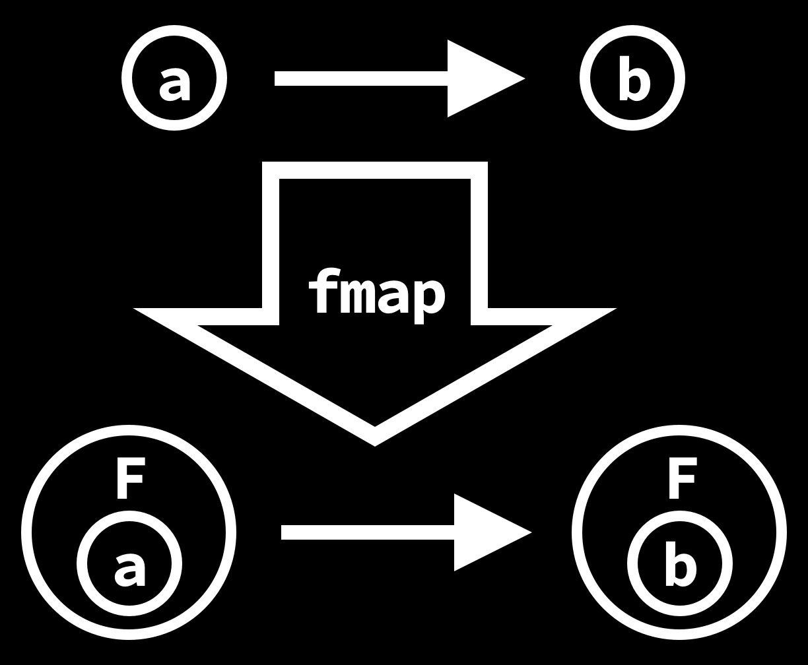

# Функциональное программирование


# Структуры

```{ .haskell .fragment }
data CircleType = Circle Double Double Double
data RectangleType = Rectangle Double Double Double Double

data Shape =
  CircleShape CircleType | RectangleShape RectangleType
```

```{.haskell .fragment}
shape = CircleShape (Circle 0 0 2)
otherShape = RectangleShape (Rectangle 1 2 3 4)
```

---

## Структура "человек"

Имя, Фамилия, Отчество, Адрес, Почта, Возраст

```{ .haskell .fragment }
data Person =
  Person String String String String String Natural
```

{height=200px .fragment}

---

## Функции!

```{ .haskell }
data Person =
  Person String String String String String Natural
```

```{ .haskell .fragment }
firstName :: Person -> String
firstName (Person name _ _ _ _ _) = name
```
```{ .haskell .fragment }
setFirstName :: String -> Person -> Person
setFirstName
  newName
  (Person _ lName mName address email age)
  = Person newName lName mName address email age
```

```{ .haskell .fragment }
lastName :: Person -> String
lastName (Person _ lName _ _ _ _) = lName
setLastName :: String -> Person -> Person
setLastName
  newLastName
  (Person fName _ mName address email age)
  = Person fName newLastName mName address email age
```

---

```{ .haskell }
middleName :: Person -> String
middleName (Person _ _ mName _ _ _) = mName
setMiddleName :: String -> Person -> Person
setMiddleName
  newMiddleName
  (Person fName lName _ address email age)
  = Person fName lName newMiddleName address email age
```

{height=200px .fragment}

[А что если структуры еще больше?]{.fragment}

---

## Record syntax

```{ .haskell .fragment }
data Person
  = Person
      { firstName :: String,
        lastName :: String,
        middleName :: String,
        address :: String,
        email :: String,
        age :: Natural
      }
```

```{ .haskell .fragment }
-- Автоматически генерируются компилятором!
firstName :: Person -> String
lastName :: Person -> String
-- ...
```

```{ .haskell .fragment }
setFirstName :: String -> Person -> String
setFirstName newName person = person {firstName = newName}
-- Делает копию, заменяя одно (или нескеолько) поле.
-- (То есть функции set... не нужны)
```

---

# Абстракция

---

> Полиморфизм -- одну реализацию можно применять к разным типам.

---

```{ .haskell }
length :: [a] -> Int
```

```{ .haskell .fragment }
map :: (a -> b) -> [a] -> [b]
```

```{ .haskell .fragment }
filter :: (a -> Bool) -> [a] -> [a]
```

[Problem: сама функция с `a` и `b` делать ничего не может -- она про них ничего не знает.]{.fragment}

---

```{.haskell}
quicksort :: [Int] -> [Int]
```

```{ .haskell .fragment }
quicksort :: [a] -> [a]
```

[Откуда `sort` узнает что такое `a` и как их сравнивать?]{.fragment}

---

## Typeclass

---

Самое близкое -- интрефейс.

> Описывает свойства, которыми должен обладать объект

---

```{ .haskell }
class Eq a where
  (==) :: a -> a -> Bool
```

[`a` относится к классу `Eq` если существует такая функция `(==) :: a -> a -> Bool`]{.fragment}

---

```{ .haskell }
class Eq a where
  (==) :: a -> a -> Bool
```

```{ .fragment .haskell }
data PersonType = Person String Int
```

```{ .fragment .haskell }
instance Eq PersonType where
  (Person name1 age1) == (Person name2 age2) =
    name1 == name2 && age1 == age2
```

[instance -- "удовлетворяет", а не "экземпляр".]{ .fragment }

---

## Использование

```{ .haskell .fragment }
notEqual :: a -> a -> Bool
```

```{ .haskell .fragment }
notEqual :: Eq a => a -> a -> Bool
notEqual a b = not (a == b)
```


---

```{ .haskell }
class Eq a => Ord a where
  (<=) :: a -> a -> Bool
```

[`a` относится к классу `Ord` если он относится к классу `Ord` и существует такая функция `(<=) :: a -> a -> Bool`]{.fragment}

---

```{ .haskell }
class Eq a => Ord a where
  (<=) :: a -> a -> Bool
```

```{ .haskell }
data PersonType = Person String Int
```

```{ .fragment .haskell }
instance Eq PersonType where
  (Person name1 age1) == (Person name2 age2) =
    name1 == name2 && age1 == age2
```

```{ .fragment .haskell }
instance Ord PersonType where
  (Person name1 age1) <= (Person name2 age2) =
    name1 <= name2 && age1 <= age2
```

---

## Использование

```{ .haskell .fragment }
(>) :: Ord a => a -> a -> Bool
a > b = not (a <= b)
```

```{ .haskell .fragment }
(>=) :: Ord a => a -> a -> Bool
a >= b = a > b || a == b
```

[Тут мы можем использовать `>` на типах `a` потому что внутри функции уже есть определение `Ord a`.]{.fragment}

---

`notEqual` в стандартной библиотеке определен как `/=`.

---

```{ .haskell }
max :: Ord a => a -> a -> a
max a b = if a > b then a else b
```

[Из-за сильной системы типов гарантируется что функция вернет один из своих аргументов.]{.fragment}

---

## Case

```{ .haskell .fragment }
data Maybe a = Just a | Nothing
```
```{ .haskell .fragment }
isJust :: Maybe a -> Bool
```

```{ .haskell .fragment }
isJust Nothing = False
isJust (Just _) = True
```

```{ .haskell .fragment }
isJust x = case x of
  Nothing -> False
  Just _ -> True
```

[Просто возможность делать pattern matching где угодно, а не только в аргументах функций.]{ .fragment }

---

```{ .haskell }
maximum :: Ord a => [a] -> Maybe a
```

```{ .haskell .fragment }
max :: Ord a => a -> a -> a
```

```{ .haskell .fragment }
maximum :: Ord a => [a] -> Maybe a
maximum [] = Nothing
maximum (x : xs) = case maximum xs of
  Nothing -> Just x
  Just y -> Just (max x y)
```

---

## Полиморфные инстансы

```{ .haskell .fragment }
instance Ord (Maybe a)
```

```{ .haskell .fragment }
instance Eq (Maybe a)
```

```{ .haskell .fragment }
instance Eq a => Eq (Maybe a) where
  (==) Nothing Nothing = True
  (==) (Just a) (Just b) = a == b
  _ == _ = False
```

```{ .haskell .fragment }
instance Ord a => Ord (Maybe a) where
  -- Потому что мы хотим чтобы Nothing был меньше всех
  Nothing <= _ = True
  (Just a) <= (Just b) = a <= b
  (Just _) <= Nothing = False
```

---

Что нам это дает?

```{ .haskell .fragment }
maximum :: Ord a => [a] -> Maybe a
maximum [] = Nothing
maximum (x : xs) = case maximum xs of
  Nothing -> Just x
  Just y -> Just (max x y)
```

```{ .haskell .fragment }
maximum :: Ord a => [a] -> Maybe a
maximum [] = Nothing
maximum (x : xs) = max (Just x) (maximum xs)
```

---

## Моноид

> Моноид -- полугруппа с нейтральным элементом

---

## Полугруппа

```{ .haskell .fragment }
class Semigroup s where
  (<>) :: s -> s -> s
```

```{ .haskell .fragment }
instance Semigroup [x] where
  a <> b = a ++ b -- конкатенация списков
```

## [Моноид]{.fragment}

```{ .haskell .fragment }
class Semigroup s => Monoid s where
  mempty :: s
```

```{ .haskell .fragment }
instance Monoid [x] where
  mempty = []
```

---

"Схлопывает" список моноидов.

```{ .haskell }
fold :: Monoid m => [m] -> m
```

```{ .haskell .fragment }
fold [] = mempty
fold (x : xs) = x <> fold xs
```

```{ .haskell .fragment }
fold [[1, 3, 5], [42, 69]]
-- [1, 3, 5, 42, 69]
```

---

```{ .haskell }
fold :: Monoid m => [m] -> m
fold [] = mempty
fold (x : xs) = x <> fold xs
```

```{ .haskell .fragment }
fold [1, 2, 3]
-- Что должно произойти?
```

---

У целых чисел нет одного определения моноида.

[Но мы можем определить свои типы!]{.fragment}

```{ .haskell .fragment }
data Sum = Sum { unSum :: Int }
```

```{ .haskell .fragment }
instance Semigroup Sum where
  (Sum a) <> (Sum b) = Sum (a + b)
```

```{ .haskell .fragment }
instance Monoid Sum where
  mempty = Sum 0
```

```{ .haskell .fragment }
map :: (a -> b) -> [a] -> [b]
```

```{ .haskell .fragment }
map (+ 1) [1, 2, 3]
-- [2, 3, 4]
```

```{ .haskell .fragment }
(unSum . fold . map Sum) [1, 2, 3]
-- 6
```

---

# Deriving

```{ .haskell .fragment }
class Show a where
  show :: a -> String
```

```{ .haskell .fragment }
data Foo = Bar Int Int String
  deriving Show
```

```{ .haskell .fragment }
show (Bar 1 2 "hello")
-- Bar 1 2 "hello"
```

```{ .haskell .fragment }
data Foo = Bar Int Int String
  deriving (Show, Eq, Ord)
```

```{ .haskell .fragment }
Bar 3 10 "hello" == Bar 3 10 "hello"
-- True
Bar 3 10 "hello" == Bar 3 10 "oh no"
-- False
```

```{ .haskell .fragment }
Bar 3 10 "hello" < Bar 4 -1000 "oh no"
-- True
```


---

## Синонимы типов

[Тип можно обозвать как-то по-другому чтобы код было удобнее читать.]{.fragment}

```{ .haskell .fragment }
type String = [Char]
```

```{ .haskell .fragment }
type Age = Int
type Name = String
```

```{ .haskell .fragment }
data Person = Person Name Age
```

[Буквально эквивалентно тому чтобы сделать find and replace по коду.]{.fragment}

---

```{ .haskell }
scream :: String -> String
scream = map toUpper
```

```{ .haskell .fragment }
type Name = String
```

```{ .haskell .fragment }
name :: Name
name = "Vasya"

-- This is fine.
scream name
-- "VASYA"
```


[В функцию `capitalize` можно передать константу типа `Name` потому что `String` и `Name` это одно и то же.]{.fragment}

---

`data` -- новый тип

`type` -- просто обозвали по-другому

---

```{ .haskell }
fold :: Monoid m => [m] -> m
fold [] = mempty
fold (x : xs) = x <> fold xs
```

```{ .haskell .fragment }
fold ["Hello", "World"]
-- "HelloWorld"
--
-- Потому что
--   type String = [Char]
```

---

# Обработка ошибок

---

```{ .java }
TreeMap<String, Integer> m = new TreeMap();
m.put("one", 1);
m.put("two", 2);
m.put("three", 3);
```

```{ .java .fragment }
m.get("one");
// 1
```

```{ .java .fragment }
m.get("five");
// null
```

```{ .java .fragment }
class TreeMap<K,V> {
  V	get(Object key) {
    ...
```

[Неявный контекст ошибки ВЕЗДЕ.]{.fragment}

---

```{ .java }
class TreeMap<K,V> {
  Pair<V, Boolean>	get(Object key) {
    ...
```

```{ .java .fragment }
Pair<Integer, Boolean> result = m.get("one");

if (result.second()) {
  print(m.first());
} else {
  print("oh no");
}
// 1
```

```{ .java .fragment }
Pair<Integer, Boolean> result = m.get("five");

if (result.second()) {
  print(m.first());
} else {
  print("oh no");
}
// oh no
```

---

```{ .java }
class TreeMap<K,V> {
  V	get(Object key) throws NoElementException {
    ...
```

```{ .java .fragment }
try {
  print(m.get("five"));
} catch (NoElementException e) {
  print("oh no");
}
// oh no
```

---

```{ .java }
class Optional<T> {
  ...
```

```{ .java .fragment }
class TreeMap<K,V> {
  Optional<V>	get(Object key) {
    ...
```

---

```{ .haskell }
m :: Map String Int
m = fromList [("one", 1), ("two", 2), ("three", 3)]
```

```{ .haskell .fragment }
data Maybe a = Just a | Nothing
```

```{ .haskell .fragment }
lookup :: k -> Map k v -> Maybe v
```

```{ .haskell .fragment }
lookup "one" m
-- Just 1
```

```{ .haskell .fragment }
lookup "five" m
-- Nothing
```

```{ .haskell .fragment }
case lookup "one" m of
  Just n -> ...
  Nothing -> ...
```

---

```{ .haskell }
data Either a b = Left a | Right b
```

```{ .haskell .fragment }
lookup :: k -> Map k v -> Either MapError v
```

```{ .haskell .fragment }
makePayment :: Card -> Amount -> Either PaymentError Card
```

```{ .haskell .fragment }
makePayment card amount =
  if balance card >= amount
    then Right (withdraw amount card)
    else Left InsufficientFunds
```

---

```{ .haskell }
-- Обновляет аккаунт пользователя новой информацией о карте
updateAccount :: Account -> Card -> Account
```

```{ .haskell .fragment }
makePayment :: Card -> Amount -> Either PaymentError Card
```

```{ .haskell .fragment }
card = creditCard account

newAcccount :: Either PaymentError Account
newAcccount =
  updateAccount account (makePayment card (RUB 150))
```

```{ .haskell .fragment }
newAcccount =
  updateAccount account (makePayment card (RUB 150))
--   (Card -> Account)    (Either PaymentError Card)
```

```{ .haskell .fragment }
newAcccount =
  case makePayment card (RUB 150) of
    Left e -> Left e
    Right c -> updateAccount account c
```

---

```{ .haskell }
newAcccount =
  updateAccount account (makePayment card (RUB 150))
--   (Card -> Account)    (Either PaymentError Card)
```

```{ .haskell .fragment }
newAcccount =
   magic (updateAccount account) (makePayment card (RUB 150))
--   |      (Card -> Account)      (Either PaymentError Card)
--   |
--  (Card -> Account)
--  -> (Either PaymentError Card
--      -> Either PaymentError Account)
```

---

## Lists!

```{ .haskell .fragment }
map :: (a -> b) -> [a] -> [b]
```

```{ .haskell .fragment }
map :: (a -> b) -> ([a] -> [b])
```

```{ .haskell .fragment }
magic ::
  (Card -> Account) ->
  ( (Either PaymentError) Card ->
    (Either PaymentError) Account
  )
```

```{ .haskell .fragment }
type F = Either PaymentError
```

```{ .haskell .fragment }
magic :: (Card -> Account) -> (F Card -> F Account)
```

---

```{ .haskell }
magic :: (Card -> Account) -> (F Card -> F Account)
```

[А мы можем обобщить `F`?]{.fragment}

```{ .haskell .fragment }
fmap ::
  Functor f =>
  (Card -> Account) ->
  (f Card -> f Account)
```

---

# Functor!

{width=450 .fragment}

{width=450 .fragment}

---

```{ .haskell }
class Functor f where
  fmap :: (a -> b) -> f a -> f b
```

```{ .haskell .fragment }
class Functor [] where
  fmap _ [] = []
  fmap f (x : xs) = f x : fmap f xs
```

```{ .haskell .fragment }
class Functor [] where
  fmap :: (a -> b) -> [a] -> [b]
  fmap _ [] = []
  fmap f (x : xs) = f x : fmap f xs
```

```{ .haskell .fragment }
class Functor Maybe where
  fmap :: (a -> b) -> Maybe a -> Maybe b
  fmap _ Nothing = Nothing
  fmap f (Just x) = Just (f x)
```

```{ .haskell .fragment }
class Functor (Either e) where
  fmap :: (a -> b) -> Either e a -> Either e b
  fmap _ (Left e) = Left e
  fmap f (Just x) = Just (f x)
```

---

```{ .haskell }
class Functor f where
  fmap :: (a -> b) -> f a -> f b
```

```{ .haskell .fragment }
class Functor (x ->) where
  fmap :: (a -> b) -> (x -> a) -> (x -> b)
  fmap (f :: a -> b) (g :: x -> a) = \x -> f (g x)
```

```{ .haskell .fragment }
  fmap (f :: a -> b) (g :: x -> a) = f . g
```

```{ .haskell .fragment }
  fmap = (.)
```

---

## Functor + Monoid
## [= Alternative!]{.fragment}


```{ .haskell .fragment }
foo :: f a -> f a -> f a
```

```{ .haskell .fragment }
class Monoid s where
  (<>) :: s -> s -> s
  mempty :: s
```

```{ .haskell .fragment }
class Functor f => Alternative f where
  (<|>) :: f a -> f a -> f a
  empty :: f a
```

---

```{ .haskell }
class Functor f => Alternative f where
  (<|>) :: f a -> f a -> f a
  empty :: f a
```

```{ .haskell .fragment }
instance Alternative Maybe where
  (Just x) <|> _ = Just x
  _ <|> y = y

  empty = Nothing
```

```{ .haskell .fragment }
Just 42 <|> Just 69
-- Just 42
```

```{ .haskell .fragment }
Nothing <|> Just 69
-- Nothing
```

---

```{ .haskell }
instance Monoid e => Alternative (Either e) where
  (Right x) <|> _ = Right x
  _ <|> y = y
  empty = Left mempty
```

```{ .haskell .fragment }
Left "oh no" <|> Right 8
-- Right 8
```

```{ .haskell .fragment }
Right 42 <|> Right 8
-- Right 42
```

```{ .haskell .fragment }
makePayment :: Card -> Amount -> Either PaymentError Card
```

```{ .haskell .fragment }
makePayment card1 (Rub 150) <|> makePayment card2 (Rub 150)
```

---

```{ .haskell }
instance Alternative [] where
  xs <|> ys = xs ++ ys
  empty = []
```

```{ .haskell .fragment }
class Applicative f => Alternative f where ...
```

```{ .haskell .fragment }
class Functor f => Applicative f where
  pure :: a -> f a
  ...
```

```{ .haskell .fragment }
mult :: Alternative f => Int -> f Int
mult n = mult' n 2
  where
    mult' n m =
      if n <= m
        then empty
        else
          if n `mod` m == 0
            then pure m <|> mult (n `div` m)
            else mult' n (m + 1)
```

---

```{ .haskell }
mult 10 :: [Int]
-- [2, 5]
```

```{ .haskell .fragment }
mult 10 :: Maybe Int
-- Just 2
```

```{ .haskell .fragment }
mult 23 :: [Int]
-- []
```

```{ .haskell .fragment }
mult 23 :: Maybe Int
-- Nothing
```

---

```{ .haskell }
import Control.Applicative
```
